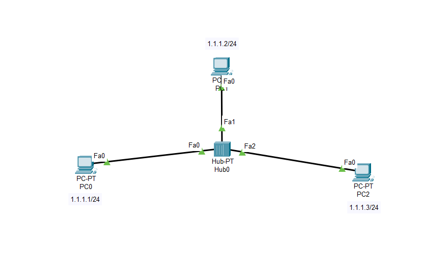

# Lab-1: Basic LAN Network

## Objective
Learn basic networking concepts by setting up a network with three PCs connected through a hub in Cisco Packet Tracer.

## Lab Topology
 

## Equipment
- 3 PCs
- 1 Hub

## Steps

1. **Open Cisco Packet Tracer.**

2. **Add Devices:**
   - Drag and drop 3 PCs and 1 Hub onto the workspace.

3. **Connect Devices:**
   - Use the copper straight-through cables to connect each PC to the hub.

4. **Assign IP Addresses:**
   - **PC1:** IP Address: `1.1.1.1`, Subnet Mask: `255.255.255.0`
   - **PC2:** IP Address: `1.1.1.2`, Subnet Mask: `255.255.255.0`
   - **PC3:** IP Address: `1.1.1.3`, Subnet Mask: `255.255.255.0`

5. **Configure IP Addresses:**
   - Click on each PC and go to the `Desktop` tab.
   - Open the `IP Configuration` and set the IP address and subnet mask as listed above.

6. **Verify Connectivity:**
   - **Using Command Prompt:**
     - Open the `Command Prompt` on each PC.
     - Use the `ping` command to test connectivity between PCs (e.g., `ping 1.1.1.2` from PC1).
   - **Using Message PDU Tool:**
     - Click the `Message` PDU tool.
     - Select the source and destination PCs.
     - Check the results in the panel below:
         - **Successful:** If the packets are successfully transmitted between PCs.
         - **Failed:** If the packets are not transmitted, indicating a connectivity issue.

## Conclusion
You have successfully set up a simple network with three PCs connected through a hub in Cisco Packet Tracer. 
This lab helps you understand basic IP configuration, connectivity testing using both Command Prompt and Message PDU tool.
