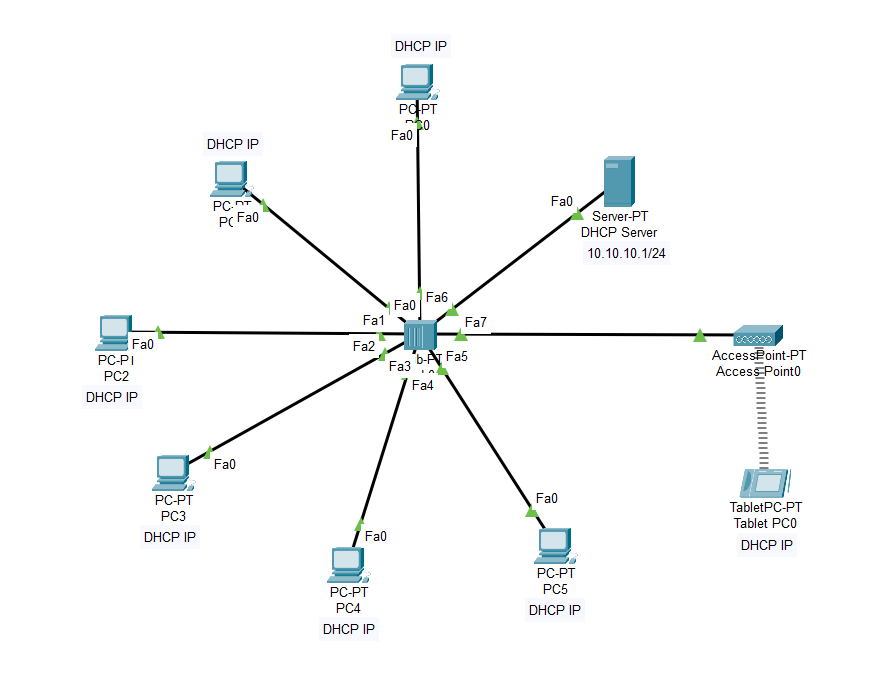

# Lab-10: Basic DHCP Server Network

## Objective
Learn how to set up a DHCP server and configure client PCs to receive IP addresses automatically. 
Analyze the process of dynamic IP allocation and ensure that all devices in the network are correctly assigned IP addresses through the DHCP server.

## Lab Topology

## Equipment
- 6 PCs
- 1 Hub
- 1 Access Point
- 1 Tab
- 1 DHCP Server

## Configuration

### IP Address Configuration

| Sl. No. | Equipment Title | Label | IP Address   | Subnet Mask     | Gateway IP Address |
|---------|-----------------|-------|--------------|-----------------|--------------------|
| 1       | DHCP Server     | DHCP  | 10.10.10.1   | 255.255.255.0   | 0.0.0.0            |
| 2       | Client PC       | PC0   | Dynamic (via DHCP) | 255.255.255.0 | 0.0.0.0        |
| 3       | Client PC       | PC1   | Dynamic (via DHCP) | 255.255.255.0 | 0.0.0.0        |
| 4       | Client PC       | PC2   | Dynamic (via DHCP) | 255.255.255.0 | 0.0.0.0        |
| 5       | Client PC       | PC3   | Dynamic (via DHCP) | 255.255.255.0 | 0.0.0.0        |
| 6       | Client PC       | PC4   | Dynamic (via DHCP) | 255.255.255.0 | 0.0.0.0        |
| 7       | Client PC       | PC5   | Dynamic (via DHCP) | 255.255.255.0 | 0.0.0.0        |
| 8       | Access Point    | AP    | Dynamic (via DHCP) | 255.255.255.0 | 0.0.0.0        |
| 9       | Tab             | Tab   | Dynamic (via DHCP) | 255.255.255.0 | 0.0.0.0        |
| 10      | Hub             | 1     |              |                 |                    |

1. **Connect Devices:**
   - Drag and drop 6 PCs, 1 Hub, 1 Access Point, and 1 Tab onto the workspace.
   - Connect all PCs, the Access Point, and the Tab directly to the Hub using copper straight-through cables.
     
2. **Set Up the DHCP Server:**
   - Click on the DHCP Server to open its configuration window.
   - Go to the `Config` tab and select `DHCP`.
   - Turn the `DHCP` service `ON`.
   - Enter the following data:
     - **Default Gateway:** `0.0.0.0`
     - **DNS Server:** `0.0.0.0`
     - **Start IP Address:** `10.10.10.1`
     - **Subnet Mask:** `255.255.255.0`
     - **Maximum Number of Users:** `8`
   - Click `Save` to apply the settings.

3. **Set IP Address for the DHCP Server:**
   - Click on the DHCP Server to open its configuration window.
   - Go to the `Config` tab and select `Fast Ethernet`.
   - Enter the following IP address settings:
     - **IP Address:** `10.10.10.1`
     - **Subnet Mask:** `255.255.255.0`
   - Ensure the `Port Status` is set to `On`.

4 **Configure Each Client PC as a DHCP Client:**
   - For each Client PC:
     - Click on the PC to open its configuration window.
     - Navigate to the `Desktop` tab and select `IP Configuration`.
     - Select `DHCP` to configure the PC to automatically obtain an IP address from the DHCP server.
     - Check if the PC has obtained an IP address in the range `10.10.10.2` to `10.10.10.9` from the DHCP server.
    
     - **Note:** No manual IP address configuration is needed for DHCP clients.

## Conclusion
You have successfully set up a DHCP server, configured client PCs to obtain IP addresses automatically and verified the dynamic IP allocation process within a network connected through a hub. 
This lab demonstrates the use of DHCP for efficient IP address management in a network.

Feel free to experiment with different DHCP configurations and network setups to deepen your understanding of DHCP and network management.
