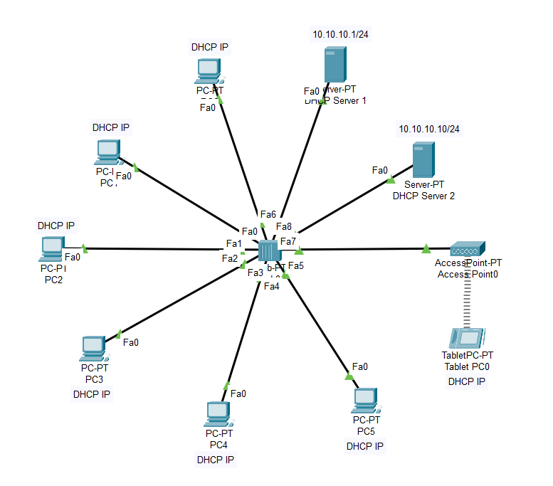

# Lab-11: Dual DHCP Server Network Setup

## Objective
Learn how to set up two DHCP servers in a network to handle IP address allocation. 
Configure client PCs to receive IP addresses automatically from either of the DHCP servers and analyze how multiple DHCP servers interact within the same network.

## Lab Topology

## Equipment
- 6 PCs
- 1 Hub
- 1 Access Point
- 1 Tab
- 2 DHCP Servers

## Configuration

### IP Address Configuration

| Sl. No. | Equipment Title | Label | IP Address   | Subnet Mask     | Gateway IP Address |
|---------|-----------------|-------|--------------|-----------------|--------------------|
| 1       | DHCP Server 1   | DHCP1 | 10.10.10.1   | 255.255.255.0   | 0.0.0.0            |
| 2       | DHCP Server 2   | DHCP2 | 10.10.10.10  | 255.255.255.0   | 0.0.0.0            |
| 3       | Client PC       | PC0   | Dynamic (via DHCP) | 255.255.255.0 | 0.0.0.0        |
| 4       | Client PC       | PC1   | Dynamic (via DHCP) | 255.255.255.0 | 0.0.0.0        |
| 5       | Client PC       | PC2   | Dynamic (via DHCP) | 255.255.255.0 | 0.0.0.0        |
| 6       | Client PC       | PC3   | Dynamic (via DHCP) | 255.255.255.0 | 0.0.0.0        |
| 7       | Client PC       | PC4   | Dynamic (via DHCP) | 255.255.255.0 | 0.0.0.0        |
| 8       | Client PC       | PC5   | Dynamic (via DHCP) | 255.255.255.0 | 0.0.0.0        |
| 9       | Access Point    | AP    | Dynamic (via DHCP) | 255.255.255.0 | 0.0.0.0        |
| 10      | Tab             | Tab   | Dynamic (via DHCP) | 255.255.255.0 | 0.0.0.0        |
| 11      | Hub             | 1     |              |                 |                    |

## Part 1: DHCP Server 1 Configuration

1. **Set Up DHCP Server 1:**
   - Click on the DHCP Server 1 to open its configuration window.
   - Go to the `Config` tab and select `DHCP`.
   - Turn the `DHCP` service `ON`.
   - Enter the following data:
     - **Default Gateway:** `0.0.0.0`
     - **DNS Server:** `0.0.0.0`
     - **Start IP Address:** `10.10.10.1`
     - **Subnet Mask:** `255.255.255.0`
     - **Maximum Number of Users:** `8`
   - Click `Save` to apply the settings.

2. **Set IP Address for DHCP Server 1:**
   - Click on DHCP Server 1 to open its configuration window.
   - Go to the `Config` tab and select `Fast Ethernet`.
   - Enter the following IP address settings:
     - **IP Address:** `10.10.10.1`
     - **Subnet Mask:** `255.255.255.0`
   - Ensure the `Port Status` is set to `On`.

## Part 2: DHCP Server 2 Configuration

1. **Set Up DHCP Server 2:**
   - Click on the DHCP Server 2 to open its configuration window.
   - Go to the `Config` tab and select `DHCP`.
   - Turn the `DHCP` service `ON`.
   - Enter the following data:
     - **Default Gateway:** `0.0.0.0`
     - **DNS Server:** `0.0.0.0`
     - **Start IP Address:** `10.10.10.30`
     - **Subnet Mask:** `255.255.255.0`
     - **Maximum Number of Users:** `8`
   - Click `Save` to apply the settings.

2. **Set IP Address for DHCP Server 2:**
   - Click on DHCP Server 2 to open its configuration window.
   - Go to the `Config` tab and select `Fast Ethernet`.
   - Enter the following IP address settings:
     - **IP Address:** `10.10.10.10`
     - **Subnet Mask:** `255.255.255.0`
   - Ensure the `Port Status` is set to `On`.

## Part 3: Configure Each Client PC as a DHCP Client

1. **Set Up Each Client PC:**
   - For each Client PC:
     - Click on the PC to open its configuration window.
     - Navigate to the `Desktop` tab and select `IP Configuration`.
     - Select `DHCP` to configure the PC to automatically obtain an IP address from one of the DHCP servers.
     - **Note:** No manual IP address configuration is needed for DHCP clients.

## Part 4: Verify DHCP Configuration

1. **Verify IP Address Assignment:**
   - Open the `Command Prompt` on each PC.
   - Use the `ipconfig` command to check if the PC has obtained an IP address from either `10.10.10.1` to `10.10.10.8` or `10.10.10.30` to `10.10.10.37`.

2. **Test Network Connectivity:**
   - On each PC, use the `ping` command to test connectivity to other devices within the network (e.g., `ping 10.10.10.1` or `ping 10.10.10.10` to check connectivity to the DHCP servers).

## Conclusion
You have successfully set up two DHCP servers, configured client PCs to obtain IP addresses automatically from either server, and verified the dynamic IP allocation process within a network connected through a hub. 
This lab demonstrates how to manage multiple DHCP servers and ensures effective IP address distribution.

Feel free to experiment with different DHCP configurations and network setups to deepen your understanding of DHCP and network management.
