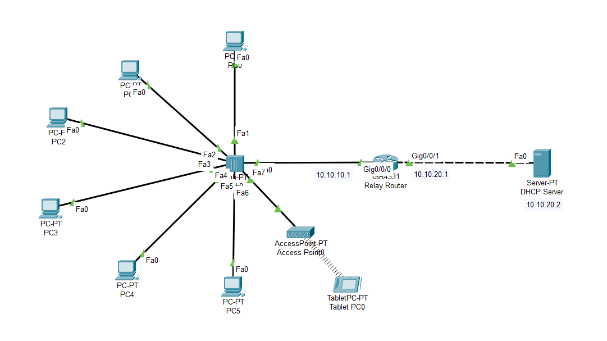

# Lab-12: DHCP Relay Agent Network 

## Objective
Learn how to set up a DHCP relay agent using a router to forward DHCP requests from client PCs to a DHCP server in a network with two different IP subnets. 
Configure client PCs to receive IP addresses automatically and verify the relay functionality.

## Lab Topology


## Equipment
- 6 PCs
- 1 Hub
- 1 Access Point
- 1 Tab
- 1 Router
- 1 DHCP Server

## Configuration

### IP Address Configuration

| Sl. No. | Equipment Title | Label | IP Address   | Subnet Mask     | Gateway IP Address |
|---------|-----------------|-------|--------------|-----------------|--------------------|
| 1       | DHCP Server     | DHCP  | 10.10.20.2   | 255.255.255.0   | 10.10.20.1         |
| 2       | Client PC       | PC0   | Dynamic (via DHCP) | 255.255.255.0 | 10.10.10.1     |
| 3       | Client PC       | PC1   | Dynamic (via DHCP) | 255.255.255.0 | 10.10.10.1     |
| 4       | Client PC       | PC2   | Dynamic (via DHCP) | 255.255.255.0 | 10.10.10.1     |
| 5       | Client PC       | PC3   | Dynamic (via DHCP) | 255.255.255.0 | 10.10.10.1     |
| 6       | Client PC       | PC4   | Dynamic (via DHCP) | 255.255.255.0 | 10.10.10.1     |
| 7       | Client PC       | PC5   | Dynamic (via DHCP) | 255.255.255.0 | 10.10.10.1     |
| 8       | Access Point    | AP    | Dynamic (via DHCP) | 255.255.255.0 | 10.10.10.1     |
| 9       | Tab             | Tab   | Dynamic (via DHCP) | 255.255.255.0 | 10.10.10.1     |
| 10      | Router          | Fa0/0    | 10.10.10.1   | 255.255.255.0   |                 |
|         |                 | Fa0/1    | 10.10.20.1   | 255.255.255.0   |                 |
| 11      | Hub             | 1     |              |                 |                    |

## Part 1: DHCP Server Configuration

1. **Set Up the DHCP Server:**
   - Click on the DHCP Server to open its configuration window.
   - Go to the `Services` tab and select `DHCP`.
   - Turn the `DHCP` service `ON`.
   - Enter the following data:
     - **Default Gateway:** `10.10.10.1`
     - **DNS Server:** `0.0.0.0`
     - **Start IP Address:** `10.10.10.5`
     - **Subnet Mask:** `255.255.255.0`
     - **Maximum Number of Users:** `8`
   - Click `Save` to apply the settings.

2. **Set IP Address for the DHCP Server:**
   - Click on the DHCP Server to open its configuration window.
   - Go to the `Desktop` tab and select `IP Configuration`.
   - Enter the following IP address settings:
     - **IP Address:** `10.10.20.2`
     - **Subnet Mask:** `255.255.255.0`
     - **Default Gateway** `10.10.20.1`
   - Ensure the `Port Status` is set to `On`.

## Part 2: Router Configuration as a DHCP Relay Agent

1. **Configure the Router:**
   - Assign the IP Address for both the interface as given the configuration table.

2. **Enter Global Configuration Mode:**
   - Access the router CLI by clicking on the router and selecting the CLI tab.
   - Configure the Router as a DHCP Relay Agent:
     - On the interface connected to the clients:
       ```plaintext
       Router(config)# interface FastEthernet0/0
       Router(config-if)# ip helper-address 10.10.20.2
       Router(config-if)# exit
       ```

   - The interface connected to the DHCP server does not need any `ip helper-address` configuration.

   - Save and Exit Configuration:
     ```plaintext
     Router# do wr
     ```

## Part 3: Configure Each Client PC as a DHCP Client

1. **Set Up Each Client PC:**
   - For each Client PC:
     - Click on the PC to open its configuration window.
     - Navigate to the `Desktop` tab and select `IP Configuration`.
     - Select `DHCP` to configure the PC to automatically obtain an IP address from the DHCP server through the relay agent.
     - **Note:** No manual IP address configuration is needed for DHCP clients.

## Part 4: Verify DHCP Relay Functionality

1. **Verify IP Address Assignment:**
   - Open the `Command Prompt` on each PC.
   - Use the `ipconfig` command to check if the PC has obtained an IP address in the range `10.10.10.5` to `10.10.10.12` from the DHCP server via the router.

2. **Test Network Connectivity:**
   - On each PC, use the `ping` command to test connectivity to other devices within the network (e.g., `ping 10.10.10.1` or `ping 10.10.20.2` to check connectivity to the router and DHCP server).

## Conclusion
You have successfully set up a router as a DHCP relay agent, configured a DHCP server and ensured that client PCs obtain IP addresses automatically through the relay. 
This lab demonstrates how a router can relay DHCP requests between different subnets and handle IP address management in a network.

Feel free to experiment with different DHCP and relay configurations to deepen your understanding of network management and DHCP protocols.
