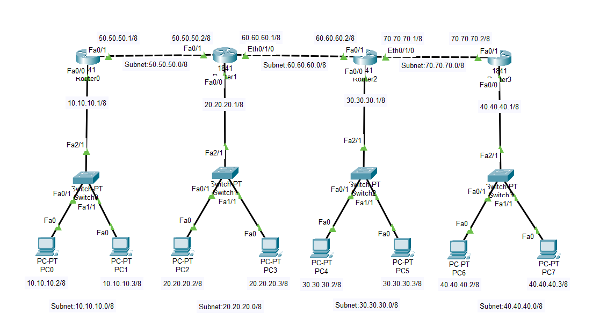

# Lab-13: Routing Information Protocol (RIP) Network

## Objective
Learn how to set up Routing Information Protocol (RIP) in a network with multiple edge networks and a core network. 
Configure routers to exchange routing information and verify the routing functionality.

## Lab Topology

## Equipment
- 8 PCs
- 4 Switches
- 4 Routers

## Configuration

### IP Address Configuration

| Sl. No. | Equipment Title | Label | IP Address   | Subnet Mask     | Gateway IP Address |
|---------|-----------------|-------|--------------|-----------------|--------------------|
| 1       | Client PC       | PC0   | 10.10.10.2   | 255.0.0.0       | 10.10.10.1         |
| 2       | Client PC       | PC1   | 10.10.10.3   | 255.0.0.0       | 10.10.10.1         |
| 3       | Client PC       | PC2   | 20.20.20.2   | 255.0.0.0       | 20.20.20.1         |
| 4       | Client PC       | PC3   | 20.20.20.3   | 255.0.0.0       | 20.20.20.1         |
| 5       | Client PC       | PC4   | 30.30.30.2   | 255.0.0.0       | 30.30.30.1         |
| 6       | Client PC       | PC5   | 30.30.30.3   | 255.0.0.0       | 30.30.30.1         |
| 7       | Client PC       | PC6   | 40.40.40.2   | 255.0.0.0       | 40.40.40.1         |
| 8       | Client PC       | PC7   | 40.40.40.3   | 255.0.0.0       | 40.40.40.1         |
| 9       | Switch0         | 1     |              |                 |                    |
| 10      | Switch1         | 1     |              |                 |                    |
| 11      | Switch2         | 1     |              |                 |                    |
| 12      | Switch3         | 1     |              |                 |                    |
| 13      | Router0         | Fa0/0 | 10.10.10.1   | 255.0.0.0       |                    |
|         |                 | Fa0/1 | 50.50.50.1   | 255.0.0.0       |                    |
| 14      | Router1         | Fa0/0 | 20.20.20.1   | 255.0.0.0       |                    |
|         |                 | Fa0/1 | 50.50.50.2   | 255.0.0.0       |                    |
|         |                 | Fa0/2 | 60.60.60.1   | 255.0.0.0       |                    |
| 15      | Router2         | Fa0/0 | 30.30.30.1   | 255.0.0.0       |                    |
|         |                 | Fa0/1 | 60.60.60.2   | 255.0.0.0       |                    |
|         |                 | Fa0/2 | 70.70.70.1   | 255.0.0.0       |                    |
| 16      | Router3         | Fa0/0 | 40.40.40.1   | 255.0.0.0       |                    |
|         |                 | Fa0/1 | 70.70.70.2   | 255.0.0.0       |                    |

### Routing Table Configuration

1. **Access Router GUI:**
   - Click on Router.
   - Go to the `Config` -> `Routing` -> `RIP`.
   - Enter the Subnet as shown in the table below.

| Router Name | Destination Network   |
|-------------|-----------------------|
| R0          | 10.0.0.0              |
|             | 50.0.0.0              |
| R1          | 20.0.0.0              |
|             | 50.0.0.0              |
|             | 60.0.0.0              |
| R2          | 30.0.0.0              |
|             | 60.0.0.0              |
|             | 70.0.0.0              |
| R3          | 40.0.0.0              |
|             | 70.0.0.0              |

2. **Apply Configuration:**
   - Click `Add` to add the routes.
   - Save the configuration.

## Steps

1. **Open Cisco Packet Tracer.**

2. **Add Devices:**
   - Drag and drop 8 PCs, 4 Switches and 4 Routers onto the workspace.

3. **Connect Devices:**
   - Connect devices as shown in the topology using copper straight-through cables.

4. **Assign IP Addresses:**
   - Configure IP addresses and gateway settings on each PC and routing table on each router as listed in the configuration table above.

5. **Verify Connectivity:**
   - **Using Command Prompt:**
     - Open the `Command Prompt` on each PC.
     - Use the `ping` command to test connectivity between PCs in different networks. For example:
       - From PC0, ping PC2: `ping 20.20.20.2`
       - From PC6, ping PC0: `ping 10.10.10.2`
     - Check for successful replies to confirm connectivity.
     
   - **Using Message PDU Tool:**
     - Click the `Message` PDU tool.
     - Select the source and destination PCs.
     - Check the results in the panel below:
       - **Successful:** If the packets are successfully transmitted between PCs.
       - **Failed:** If the packets are not transmitted, indicating a connectivity issue.

6. **Verify Routing Table:**
   - Select `Inspection Tool` and right-click on Router.
   - Select `Routing Table` and verify the connections.
   - **Note:** C->Connected, R->RIP 

## Conclusion
You have successfully set up RIP in a network with multiple edge networks and core routers. This lab demonstrates how routers can exchange routing information and maintain network connectivity.
Feel free to experiment with different RIP configurations to deepen your understanding of routing protocols and network management.
