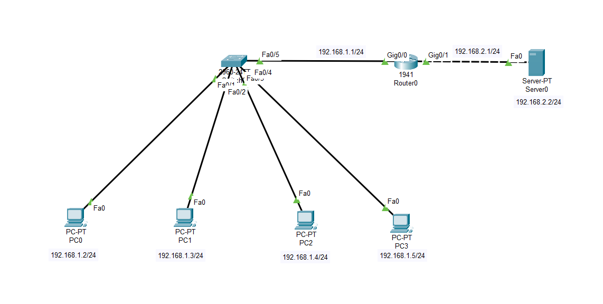

# Lab-3: Basic Client-Server Network

## Objective
Learn basic networking concepts by setting up an access network with PCs, switch, router and a server in Cisco Packet Tracer.

## Lab Topology
 

## Equipment
- 4 PCs
- 1 Switch
- 1 Router with 2 interfaces
- 1 Server

## Configuration

| Sl. No. | Equipment Title              | Label | IP Address    | Subnet Mask       | Gateway IP Address |
|---------|------------------------------|-------|---------------|-------------------|---------------------|
| 1       | Desktop Computer             | PC0   | 192.168.1.2   | 255.255.255.0     | 192.168.1.1         |
|         |                              | PC1   | 192.168.1.3   | 255.255.255.0     | 192.168.1.1         |
|         |                              | PC2   | 192.168.1.4   | 255.255.255.0     | 192.168.1.1         |
|         |                              | PC3   | 192.168.1.5   | 255.255.255.0     | 192.168.1.1         |
| 2       | Switch                       | 1     |               |                   |                     |
| 3       | Router with 2 interfaces     | Fa0/0 | 192.168.1.1   | 255.255.255.0     |                     |
|         |                              | Fa1/0 | 192.168.2.1   | 255.255.255.0     |                     |
| 4       | Server                       | 1     | 192.168.2.2   | 255.255.255.0     | 192.168.2.1         |

## Steps

1. **Open Cisco Packet Tracer.**

2. **Add Devices:**
   - Drag and drop 4 PCs, 1 Switch, 1 Router and 1 Server onto the workspace.

3. **Connect Devices:**
   - Use copper straight-through cables to connect each PC to the switch.
   - Connect the switch to the router using a copper straight-through cable.
   - Connect the router to the server using a copper straight-through cable.

4. **Assign IP Addresses:**
   - Configure IP addresses and gateway settings on each PC and server as listed in the configuration table above.

5. **Verify Connectivity:**
   - **Using Command Prompt:**
     - Open the `Command Prompt` on each PC.
     - Use the `ping` command to test connectivity between PCs and the server (e.g., `ping 192.168.1.3` from PC0 or `ping 192.168.2.2` from any PC).
   - **Using Message PDU Tool:**
     - Click the `Message` PDU tool.
     - Select the source and destination PCs.
     - Check the results in the panel below:
         - **Successful:** If the packets are successfully transmitted between PCs.
         - **Failed:** If the packets are not transmitted, indicating a connectivity issue.

## Conclusion
You have successfully set up an access network with multiple PCs, a switch, a router and a server in Cisco Packet Tracer. 
This lab helps you understand IP configuration and routing.
