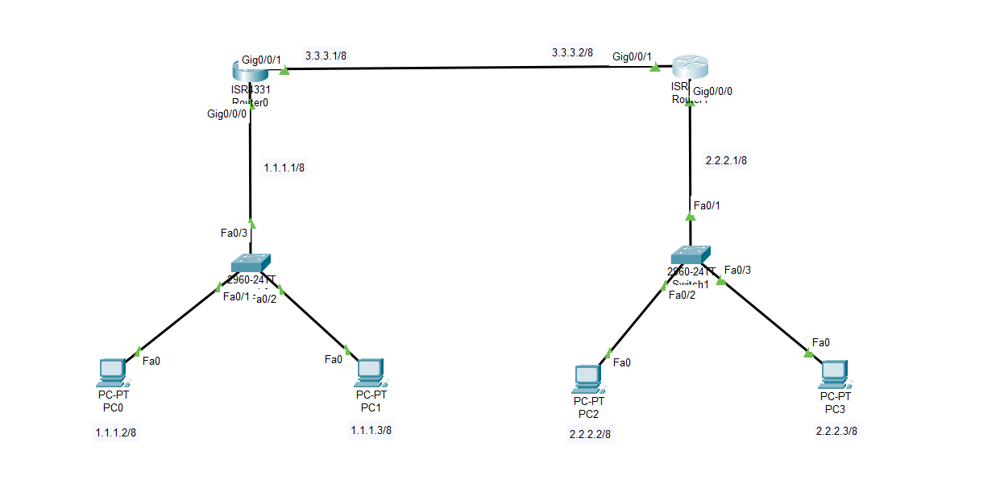

# Lab-4: Two-Router Network Setup

## Objective
Learn advanced networking concepts by setting up a network with two routers and three distinct networks in Cisco Packet Tracer.

## Lab Topology
 

## Equipment
- 4 PCs
- 2 Switches
- 2 Routers

## Configuration

| Sl. No. | Equipment Title              | Label | IP Address    | Subnet Mask       | Gateway IP Address |
|---------|------------------------------|-------|---------------|-------------------|---------------------|
| 1       | Desktop Computer             | PC0   | 1.1.1.2       | 255.0.0.0         | 1.1.1.1             |
|         |                              | PC1   | 1.1.1.3       | 255.0.0.0         | 1.1.1.1             |
|         |                              | PC2   | 2.2.2.2       | 255.0.0.0         | 2.2.2.1             |
|         |                              | PC3   | 2.2.2.3       | 255.0.0.0         | 2.2.2.1             |
| 2       | Switch                       | 1     |               |                   |                     |
| 3       | Router1                      | Fa0/0 | 1.1.1.1       | 255.0.0.0         |                     |
|         |                              | Fa0/1 | 3.3.3.1       | 255.0.0.0         |                     |
| 4       | Router2                      | Fa0/0 | 2.2.2.1       | 255.0.0.0         |                     |
|         |                              | Fa0/1 | 3.3.3.2       | 255.0.0.0         |                     |

### Routing Table Configuration

1. **Access Router GUI:**
   - Click on Router.
   - Go to the `Config` -> `Routing` -> `Static`.
   - Enter the network, subnet mask and next hop as shown in the table.

| Network       | Subnet Mask   | Next Hop    |
|---------------|---------------|-------------|
| 2.0.0.0       | 255.0.0.0     | 3.3.3.2     |
| 1.0.0.0       | 255.0.0.0     | 3.3.3.1     |

## Steps

1. **Open Cisco Packet Tracer.**

2. **Add Devices:**
   - Drag and drop 4 PCs, 2 Switches, and 2 Routers onto the workspace.

3. **Connect Devices:**
     - Connect devices as shown in the topology using a copper straight-through cable.

4. **Assign IP Addresses:**
   - Configure IP addresses and gateway settings on each PC and routing table on each router and  as listed in the configuration table above.

5. **Verify Connectivity:**
   - **Using Command Prompt:**
     - Open the `Command Prompt` on each PC.
     - Use the `ping` command to test connectivity between PCs in the same network and across different networks (e.g., `ping 2.2.2.2` from PC0 or `ping 1.1.1.2` from PC2).
   - **Using Message PDU Tool:**
   - **Using Message PDU Tool:**
     - Click the `Message` PDU tool.
     - Select the source and destination PCs.
     - Check the results in the panel below:
         - **Successful:** If the packets are successfully transmitted between PCs.
         - **Failed:** If the packets are not transmitted, indicating a connectivity issue.

## Conclusion
You have successfully set up a two-router network with three different networks and inspected PDUs in Cisco Packet Tracer. 
This lab helps you understand IP configuration, inter-router communication and network routing.
