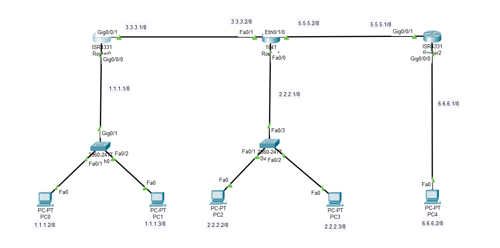

# Lab-5: Three-Router Network

## Objective
Learn advanced networking concepts by setting up a network with three routers and five distinct networks in Cisco Packet Tracer.

## Lab Topology
 

## Equipment
- 5 PCs
- 2 Switches
- 3 Routers

## Configuration

### Network Configuration

| Sl. No. | Equipment Title              | Label | IP Address    | Subnet Mask       | Gateway IP Address |
|---------|------------------------------|-------|---------------|-------------------|---------------------|
| 1       | Desktop Computer             | PC0   | 1.1.1.2       | 255.0.0.0         | 1.1.1.1             |
|         |                              | PC1   | 1.1.1.3       | 255.0.0.0         | 1.1.1.1             |
|         |                              | PC2   | 2.2.2.2       | 255.0.0.0         | 2.2.2.1             |
|         |                              | PC3   | 2.2.2.3       | 255.0.0.0         | 2.2.2.1             |
|         |                              | PC4   | 6.6.6.2       | 255.0.0.0         | 6.6.6.1             |
| 2       | Switch                       | 1     |               |                   |                     |
| 3       | Router0                      | Fa0/0 | 1.1.1.1       | 255.0.0.0         |                     |
|         |                              | Fa0/1 | 3.3.3.1       | 255.0.0.0         |                     |
| 4       | Router1                      | Fa0/0 | 2.2.2.1       | 255.0.0.0         |                     |
|         |                              | Fa0/1 | 3.3.3.2       | 255.0.0.0         |                     |
|         |                              | Fa0/2 | 5.5.5.2       | 255.0.0.0         |                     |
| 5       | Router2                      | Fa0/0 | 6.6.6.1       | 255.0.0.0         |                     |
|         |                              | Fa0/1 | 5.5.5.1       | 255.0.0.0         |                     |

### Routing Table Configuration

1. **Access Router GUI:**
   - Click on Router.
   - Go to the `Config` -> `Routing` -> `Static`.
   - Enter the network, subnet mask and next hop as shown in the table.

| Router Name | Destination Network  | Subnet Mask   | Next Hop    |
|-------------|----------------------|---------------|-------------|
| R0          | 2.0.0.0              | 255.0.0.0     | 3.3.3.2     |
|             | 6.0.0.0              | 255.0.0.0     | 3.3.3.2     |
| R1          | 1.0.0.0              | 255.0.0.0     | 3.3.3.1     |
|             | 6.0.0.0              | 255.0.0.0     | 5.5.5.1     |
| R2          | 1.0.0.0              | 255.0.0.0     | 5.5.5.2     |
|             | 2.0.0.0              | 255.0.0.0     | 5.5.5.2     |

2. **Apply Configuration:**
   - Click `Add` to add the routes.
   - Save the configuration.

## Steps

1. **Open Cisco Packet Tracer.**

2. **Add Devices:**
   - Drag and drop 5 PCs, 2 Switches, and 3 Routers onto the workspace.

3. **Connect Devices:**
   - Connect devices as shown in the topology using a copper straight-through cable.

4. **Assign IP Addresses:**
   - Configure IP addresses and gateway settings on each PC and routing table on each router and as listed in the configuration table above.

5. **Verify Connectivity:**
   - **Using Command Prompt:**
     - Open the `Command Prompt` on each PC.
     - Use the `ping` command to test connectivity between PCs in different networks. For example:
       - From PC0, ping PC2: `ping 2.2.2.2`
       - From PC4, ping PC0: `ping 1.1.1.2`
     - Check for successful replies to confirm connectivity.
     
   - **Using Message PDU Tool:**
     - Click the `Message` PDU tool.
     - Select the source and destination PCs.
     - Check the results in the panel below:
       - **Successful:** If the packets are successfully transmitted between PCs.
       - **Failed:** If the packets are not transmitted, indicating a connectivity issue.

## Conclusion
You have successfully set up a multi-router network with five different networks and configured static routing in Cisco Packet Tracer. 
This lab helps you understand IP configuration, inter-router communication and complex routing setup.
