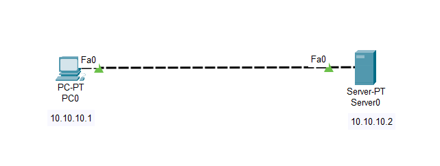

# Lab-7: Basic HTTP Server Network

## Objective
Learn how to set up a basic HTTP server and analyze HTTP PDUs by connecting a single PC directly to an HTTP server in Cisco Packet Tracer.

## Lab Topology


## Equipment
- 1 PC
- 1 HTTP Server

## Configuration

| Sl. No. | Equipment Title | Label | IP Address | Subnet Mask |
|---------|-----------------|-------|------------|-------------|
| 1       | PC              | PC0   | 10.10.10.1 | 255.0.0.0   |
| 2       | HTTP Server     | Server| 10.10.10.2 | 255.0.0.0   |

## Steps

1. **Open Cisco Packet Tracer.**

2. **Add Devices:**
   - Drag and drop 1 PC and 1 HTTP Server onto the workspace.

3. **Connect Devices:**
   - Use a copper straight-through cable to connect the PC to the HTTP Server directly.

4. **Assign IP Addresses:**
   - Configure IP addresses on the PC and HTTP Server as listed in the configuration table above.

5. **Setup HTTP Server:**
   - Click on the HTTP Server.
   - Navigate to `Services` tab, select the `HTTP` tab.
   - Ensure that the **HTTP** and **HTTPS** service is enabled.

6. **Modify `index.html` File:**
   - Click on `edit` tab besides to `index.html` file.
   - Replace the existing content with the following HTML code:

     ```html
     <!DOCTYPE html>
     <html>
     <head>
         <title>Welcome to My Server</title>
     </head>
     <body>
         <h1>Hello, World!</h1>
         <p>This is a custom index.html page served by the HTTP server.</p>
     </body>
     </html>
     ```

7. **Configure the PC to Access the HTTP Server:**
   - Open the `Desktop` tab on the PC.
   - Click on `Web Browser`.
   - Enter the HTTP Server IP address (`10.10.10.2`) in the URL field and hit `Enter`.

8. **Analyze HTTP PDU:**
   - Click on the `Simulation` tab in Cisco Packet Tracer.
   - Select the `HTTP` protocol from the list of available protocols.
   - Generate an HTTP request by accessing the HTTP server from the PC (as described in Step 7).
   - Observe the HTTP PDU details:
     - **HTTP Version:** Check the version of HTTP used (e.g., HTTP/1.1).
     - **Content Length:** Verify the length of the content being sent.
     - **Checksum:** Inspect the checksum value for data integrity.
     - **Other Important Fields:** Analyze other fields such as `Host`, `User-Agent`, `Accept`, etc.

9. **Verify Connectivity and Page Access:**
   - Ensure that the web page with your custom `index.html` content is displayed correctly in the web browser on the PC.
   - Confirm that there are no errors and that the content matches the HTML you specified.

## Conclusion
You have successfully set up a basic HTTP server, modified the `index.html` file, and verified HTTP communication between a PC and the server. You also learned how to analyze HTTP PDUs and inspect important HTTP fields.

Feel free to experiment with different HTML content and HTTP configurations to further your understanding of web servers and HTTP protocols.
