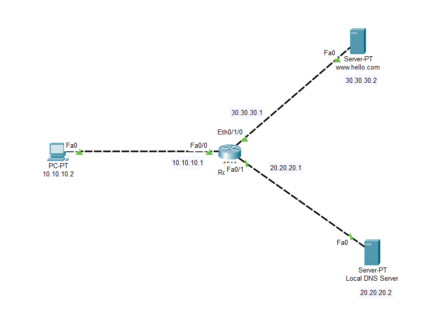

# Lab-8: Basic HTTP Server and DNS Server Network

## Objective
Learn how to set up a basic HTTP server and DNS server and analyze how DNS works by connecting a single PC to a DNS server and a web server in Cisco Packet Tracer.

## Lab Topology


## Equipment
- 1 Client PC
- 1 Web Server
- 1 Local DNS Server
- 1 Router with 3 interfaces

## Configuration

### IP Address Configuration

| Sl. No. | Equipment Title | Label | IP Address | Subnet Mask   | Gateway IP Address |
|---------|-----------------|-------|------------|---------------|--------------------|
| 1       | Client PC       | PC0   | 10.10.10.2 | 255.0.0.0     | 10.10.10.1         |
| 2       | Web Server      | Server| 30.30.30.2 | 255.0.0.0     | 30.30.30.1         |
| 3       | Local DNS Server| DNS   | 20.20.20.2 | 255.0.0.0     | 20.20.20.1         |
| 4       | Router0         | Fa0/0 | 10.10.10.1 | 255.0.0.0     |                    |
|         |                 | Fa0/1 | 20.20.20.1 | 255.0.0.0     |                    |
|         |                 | Fa0/2 | 30.30.30.1 | 255.0.0.0     |                    |

## Part 1: Basic HTTP Server and DNS Configuration

1. **Create the Topology:**
   - Drag and drop 1 Client PC, 1 Web Server and 1 Local DNS Server onto the workspace.
   - Add 1 Router with 3 interfaces.
   - Connect the Client PC, Web Server and Local DNS Server to the router using copper straight-through cables as shown in the topology.

2. **Configure IP Addresses:**
   - Assign the IP addresses to the Client PC, Web Server, Local DNS Server and Router as listed in the configuration table above.

3. **Configure DNS Server:**
   - Click on the Local DNS Server to open its configuration window.
   - Go to the `Services` and select `DNS`.
   - Ensure the DNS service is enabled.
   - Add a DNS record:
     - **Name:** `www.hello.com`
     - **Type:** `A Record`
     - **IP Address:** `30.30.30.2`

4. **Configure Web Server:**
   - Click on the Web Server to open its configuration window.
   - Go to the `Services` tab and select `HTTP`.
   - Ensure the HTTP service is enabled.
   - Modify the `index.html` file:
     - Replace the existing content with the following HTML code:

       ```html
       <!DOCTYPE html>
       <html>
       <head>
           <title>Welcome to My Server</title>
       </head>
       <body>
           <h1>Hello, World!</h1>
           <p>This is a custom index.html page served by the HTTP server.</p>
       </body>
       </html>
       ```

5. **Configure the Client PC:**
   - Click on the Client PC to open its configuration window.
   - Navigate to the `Desktop` tab and select `IP Configuration`.
   - Set the `DNS Server` IP address to `20.20.20.2`.
   - Ensure the `Gateway` IP address is set to `10.10.10.1`.

6. **Test DNS Resolution:**
   - Open the `Web Browser` on the Client PC.
   - Enter the URL `www.hello.com` and press `Enter`.
   - Verify that the web page displays the custom `index.html` content.

## Conclusion
You have successfully set up a basic HTTP server and DNS server, configured DNS resolution and verified DNS operations within a network connected through a router. You also learned how to analyze DNS queries and responses.

Feel free to experiment with different DNS configurations and HTTP content to further your understanding of web servers and DNS protocols.
