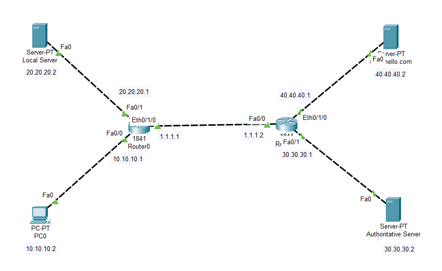

# Lab-9: HTTP DNS and Authoritative Server Network

## Objective
Learn how to set up a basic HTTP server, DNS server and authoritative DNS server, and analyze how DNS works by connecting a single PC to these servers through multiple routers in Cisco Packet Tracer.

## Lab Topology


## Equipment
- 1 Client PC
- 1 Web Server
- 1 Local DNS Server
- 1 Authoritative DNS Server
- 2 Routers with 3 interfaces

## Configuration

### IP Address Configuration

| Sl. No. | Equipment Title      | Label    | IP Address   | Subnet Mask   | Gateway IP Address |
|---------|----------------------|----------|--------------|---------------|---------------------|
| 1       | Client PC            | PC0      | 10.10.10.2   | 255.0.0.0     | 10.10.10.1          |
| 2       | Web Server           | Server   | 40.40.40.2   | 255.0.0.0     | 40.40.40.1          |
| 3       | Local DNS Server     | DNS      | 20.20.20.2   | 255.0.0.0     | 20.20.20.1          |
| 4       | Authoritative DNS Server | AuthDNS | 30.30.30.2| 255.0.0.0     | 30.30.30.1          |
| 5       | Router0              | Fa0/0    | 10.10.10.1   | 255.0.0.0     |                     |
|         |                      | Fa0/1    | 20.20.20.1   | 255.0.0.0     |                     |
|         |                      | Fa0/2    | 1.1.1.1      | 255.0.0.0     |                     |
| 6       | Router1              | Fa0/0    | 1.1.1.2      | 255.0.0.0     |                     |
|         |                      | Fa0/1    | 30.30.30.1   | 255.0.0.0     |                     |
|         |                      | Fa0/2    | 40.40.40.1   | 255.0.0.0     |                     |

### Routing Table Configuration

1. **Access Router GUI:**
   - Click on Router.
   - Go to the `Config` -> `Routing` -> `Static`.
   - Enter the network, subnet mask and next hop as shown in the table.

| Router Name | Destination Network  | Subnet Mask   | Next Hop    |
|-------------|----------------------|---------------|-------------|
| R0          | 30.0.0.0             | 255.0.0.0     | 1.1.1.2     |
|             | 40.0.0.0             | 255.0.0.0     | 1.1.1.2     |
| R1          | 10.0.0.0             | 255.0.0.0     | 1.1.1.1     |
|             | 20.0.0.0             | 255.0.0.0     | 1.1.1.1     |

2. **Apply Configuration:**
   - Click `Add` to add the routes.
   - Save the configuration.

## Part 1: Basic HTTP Server and DNS Configuration

1. **Create the Topology:**
   - Drag and drop 1 Client PC, 1 Web Server, 1 Local DNS Server, and 1 Authoritative DNS Server onto the workspace.
   - Add 2 Routers with 3 interfaces each.
   - Connect the Client PC, Web Server, Local DNS Server and Authoritative DNS Server to the routers using copper straight-through cables as shown in the topology.

2. **Configure IP Addresses:**
   - Assign the IP addresses to the Client PC, Web Server, Local DNS Server, Authoritative DNS Server and Routers as listed in the configuration table above.
   - Configure router interfaces with the IP addresses and subnet masks as listed in the router interfaces configuration table.

3. **Configure DNS Servers:**
   - **Local DNS Server Configuration:**
     - Click on the Local DNS Server to open its configuration window.
     - Go to the `Services` tab and select `DNS`.
     - Ensure the DNS service is enabled.
     - Add DNS records:
       - **Name:** `authoritative`
       - **Type:** `A Record`
       - **IP Address:** `30.30.30.2`
       - **Name:** `www.hello.com`
       - **Type:** `NS Record`
       - **IP Address:** `authoritative`

   - **Authoritative DNS Server Configuration:**
     - Click on the Authoritative DNS Server to open its configuration window.
     - Go to the `Services` tab and select `DNS`.
     - Ensure the DNS service is enabled.
     - Add a DNS record:
       - **Name:** `www.hello.com`
       - **Type:** `A Record`
       - **IP Address:** `40.40.40.2`

4. **Configure Web Server:**
   - Click on the Web Server to open its configuration window.
   - Go to the `Services` tab and select `HTTP`.
   - Ensure the HTTP service is enabled.
   - Modify the `index.html` file:
     - Replace the existing content with the following HTML code:

       ```html
       <!DOCTYPE html>
       <html>
       <head>
           <title>Welcome to My Server</title>
       </head>
       <body>
           <h1>Hello, World!</h1>
           <p>This is a custom index.html page served by the HTTP server.</p>
       </body>
       </html>
       ```

5. **Configure the Client PC:**
   - Click on the Client PC to open its configuration window.
   - Navigate to the `Desktop` tab and select `IP Configuration`.
   - Set the `DNS Server` IP address to `20.20.20.2`.
   - Ensure the `Gateway` IP address is set to `10.10.10.1`.

6. **Test DNS Resolution:**
   - Open the `Web Browser` on the Client PC.
   - Enter the URL `www.hello.com` and press `Enter`.
   - Verify that the web page displays the custom `index.html` content.

## Conclusion
You have successfully set up a basic HTTP server, Local DNS server and Authoritative DNS server, configured DNS resolution and verified DNS operations within a network connected through multiple routers.

Feel free to experiment with different DNS configurations and HTTP content to further your understanding of web servers and DNS protocols.
